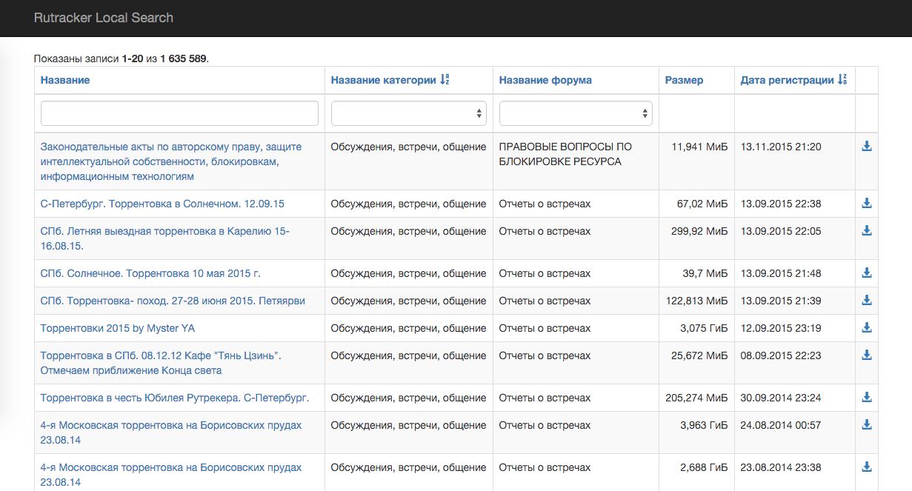

# rutracker-yii2
Yii2 application for Rutracker.org torrents database

## How to use:

1. Clone this repository to server / localhost / whatever;
1. cd project folder, `composer install`;
1. Run `./init`. Choose environment (production / development);
1. Create the database, configure access to database from Yii2;
1. Run `./yii migrate`;
1. Configure you web-server to access the project;
1. Download Rutracker torrents listing from [here](http://rutracker.org/forum/viewtopic.php?t=4824458);
1. Create `project_folder/frontend/runtime/csv` dir;
1. Place last version of downloaded files (e. g. files from `rutracker-torrents/20150204` folder) to `project_folder/frontend/runtime/csv`;
1. Run `./yii import/import`
1. Enjoy :)

## Data Format

Data in in [csv](https://ru.wikipedia.org/wiki/CSV)

File `category_info.csv`:

```
"Category ID";"Category Name";"File Name"
```

Files `category_*.csv`:

```
"Forum ID";"Forum Name";"Topic ID";"Info Hash";"Topic Name";"Size (in bytes)";"Torrent registration date"
```

## Sphinx configuration

Example [here](spinx.conf.md).

Run index:

```
indexer --config /etc/sphinxsearch/sphinx.conf --all # For the first run
indexer --config /etc/sphinxsearch/sphinx.conf --rotate --all # If daemon started
```

## How it works

Web-interface shows all torrents in standard Yii2 GridView. Searching through the table grid be with Spinx.

You can access to magnet-link without visit rutracker.

